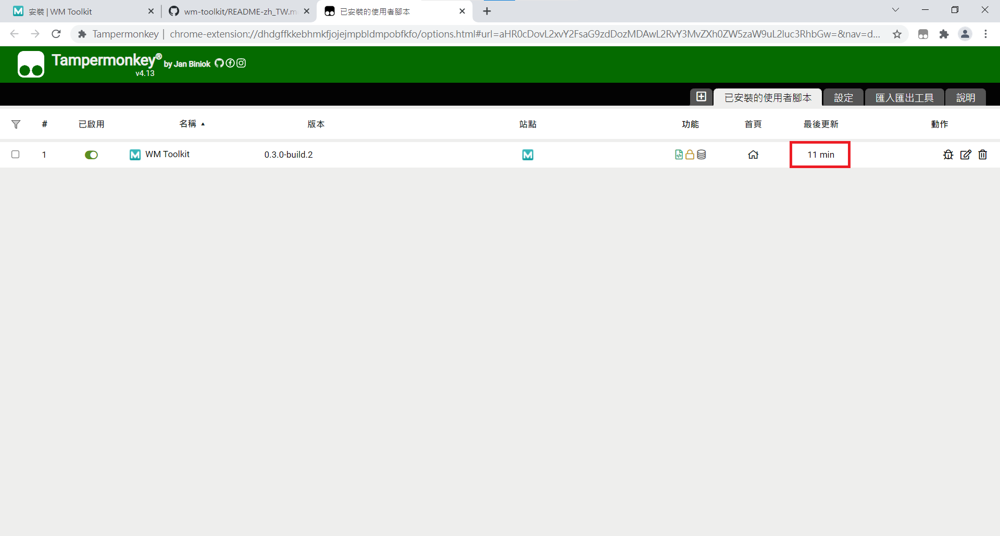
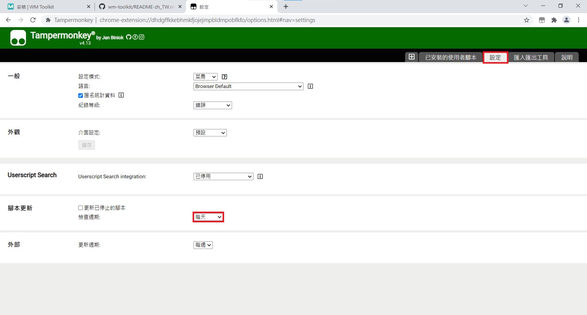

WM Toolkit 是一個以 Tampermonkey 為基礎開發的插件，舉凡影片下載、設定題目分類和自動帶入試卷等能讓 E Learning 更好用的功能，都可以在 Wm Toolkit 中找到，現在就趕快來安裝吧~

## 在你的 Chrome/Edge 上安裝 TamperMonkey

如果你曾經安裝過 TamperMonkey，可以跳過此步驟直接安裝 WM Toolkit。

點擊下面的圖片來安裝 TamperMonkey。

## 新增 WM Toolkit 到 TamperMonkey

點擊下面的下載連結，它將會帶你到 TamperMonkey 的腳本安裝頁面，點選安裝按鈕即可將 WM Toolkit 新增到 TamperMonkey，如此便完成安裝啦！

下載連結: https://jenkins.webzyno.com/job/KMU%20Development%20Team/job/wm-toolkit/job/master/lastSuccessfulBuild/artifact/dist/wm-toolkit.user.js

指紋: https://jenkins.webzyno.com/job/KMU%20Development%20Team/job/wm-toolkit/job/master/lastSuccessfulBuild/artifact/dist/wm-toolkit.user.js/*fingerprint*/

我們使用 Jenkins 來建置我們的專案，如果你對此不滿意，你可以自己建構。我們擁抱開源軟體！

## 更新

點擊 Chrome 右上角的 TamperMonkey 插件按鈕，並選擇控制台。
在已安裝的使用者腳本畫面中，找到 WM Toolkit 並點擊最後更新的欄位，他會檢查並完成更新。

:::tip 提示
你也可以在 Tampermonkey 的設定頁面中更改腳本更新的檢查週期，如此一來，Tampermonkey 就會按照你的設定值自動檢查更新，你就可以解放你的雙手，將麻煩的事交給 Tampermonkey。

:::
