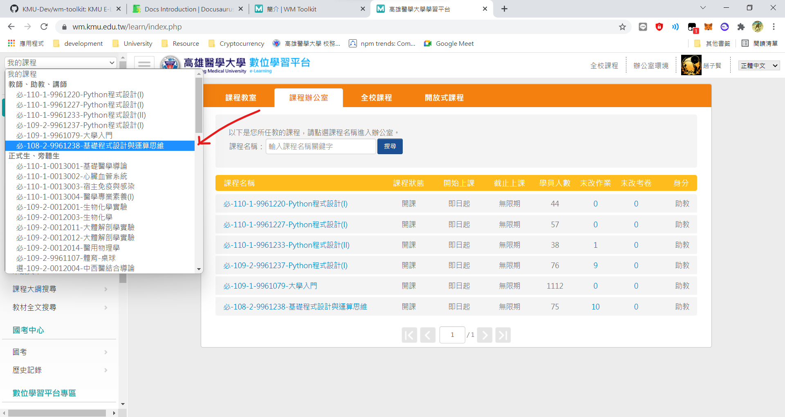
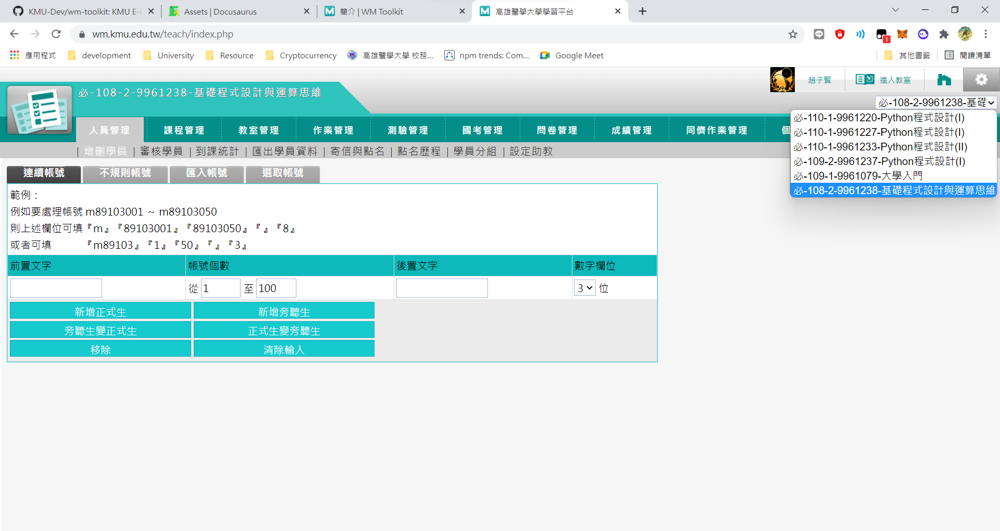

# 簡介

讓我們開始學習如何在 E Learning 上製作考古，並靠著 WM Toolkit 節省您處理瑣碎事務的時間。

## 在開始之前

請打開你的 E Learning 並確認在 **教師、助教、講師** 的欄位下是否有出現 *必108-2-9961238 基礎程式設計與運算思維*。

如果沒有看到課程，請在群組回報，會有人將你加入課程。

## 進入辦公室環境

往後的所有操作幾乎都離不開 E Learning 的辦公室環境，進入的方式請點擊上方位於頭像左側的 **辦公室環境** 按鈕，並確認所選的課程是否同樣是 *必108-2-9961238 基礎程式設計與運算思維*。

## 旅程正要開始

在接下來的教學中，我們會詳細的介紹如何使用 E Learning 的測驗功能，並為題目建立正確的分類。此外，你也會學習如何用 WM Toolkit 這個好用的 Tampermonkey 腳本讓你在題目分類和建立測驗的過程中更順利。

考古製作教學：[認領考古](past-exam/claim-exam.md)

WM Toolkit 插件使用教學：
