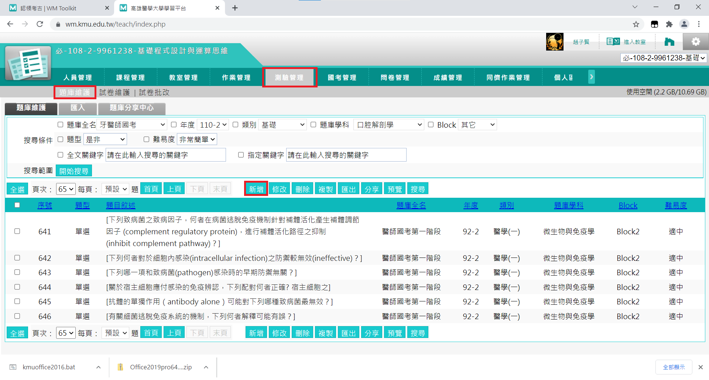

# 新增題目

進入 E Learning 的辦公室環境後，點擊上方的**測驗管理**，並選擇**題庫維護**，接著抵選下方的**新增**按鈕，就可以進到新增題目的畫面了。

## 選擇題目

在選擇哪些題目需要製作成題庫時，以下幾點原則請大家遵守：

1. 僅需製作 M107~M105 的考古。
2. 因為每年 Block 的編排方式有所不同，請大家按照上課標題而不是共筆編號去搜尋題目，如果搜尋不到題目，很有可能是期中期末的範圍對調，因此再麻煩大家能夠仔細檢查，找出所有題目。
3. 如果發現授課老師不同，則該年的考古不用列入到題庫中。

## 複製題目

進到新增題目的畫面後，請點選上方的**單選**，並將題目貼到**題目敘述**的欄位中，如果題目包含圖片，則將題目從 pdf 檔存下來後，新增到**題目附檔**的欄位中。

選項請大家按照順序貼上，並記得要圈選正確選項前的按鈕。

詳解的製作方式則和題目相同，將詳解複製後貼在詳解的欄位中即可。

:::tip 提示
由於題目在製作成試卷後會打散，如果遇到題組題，請大家將題組的題幹和圖片貼到每個子題中，如此一來大家才能看到完整的題目。
:::

:::caution 警告
使用 Adobe Acrobat 或其他 pdf 軟體複製題目和詳解時，會自動換行，因此在貼上時，請將多餘的換行刪除，以維持題目原本的格式。
:::

## 修改分類

為了讓之後建立試卷的過程更順利，也讓題目的格式一致，我們對於試題的分類有一些規定，請大家在設定分類時務必遵守：

1. **題庫全名**：醫師國考第一階段
2. **年度**：請依據*考古工作分配表*的年度欄位填寫
3. **類別**：醫學(ㄧ)
4. **題庫學科**：依據題目的科目而定
5. **Block**：依據題目的 Block 而定

:::tip 提示
我知道要大家一個一個設定分類很累，而且學校的系統也真的是難用到不行，為了大家著想，我為大家開發出一款插件，讓大家能用快捷鍵的方式快速設定分類，幫大家節省寶貴的時間，詳細的說明會放在[插件使用](../extension/question-classification.md)的章節中。
:::

最後只要點擊下方的**確定新增**按鈕就可以新增題目啦！
