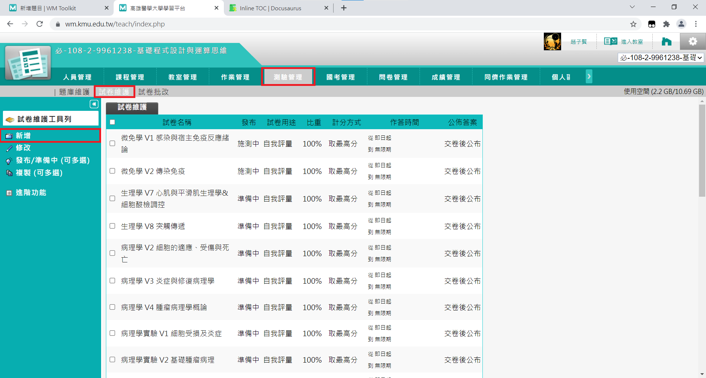
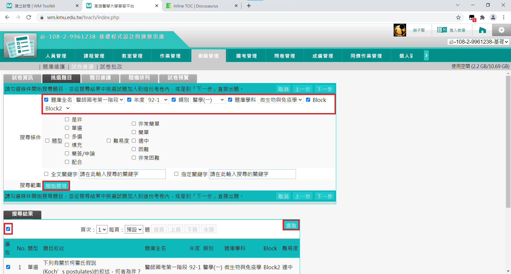

# 建立試卷

新增好該本共筆所有的考古後，是時候來建立了~

一樣在**測驗管理**的共工具列下方，有一個**試卷維護**的按鈕，接著點擊左方**新增**按鈕，就可以新增一份試卷。

## 編輯試卷資訊

大家在試卷資訊的介面中可以看到許多欄位，以下我會告訴大家個個欄位應該填寫什麼內容，如果有欄位下面沒有說明，則使用系統的預設值即可。

1. **試卷名稱**：按照*考古工作分配表*的範圍欄位填寫
2. **作答說明/師長叮嚀**：第一行請填考古年份，Ex: M107~M105 考古，第二行請填寫你的名字，Ex: 編撰：趙子賢
3. **發布**：發布
4. **測驗對象**：點擊修改按鈕，將標題設為 Block，並點擊下方個別帳號的按鈕，系統會跳出一張修課名單，請將所有參與考古製作的人員勾選，並點選確認，關閉前請確認所有人都有在個別帳號的欄位中，接著點選確定。
5. **測驗次數**：0
6. **公布答案**：作答完公布→公布成績、作答結果及標準答案

完成後即可點擊下一步。

:::tip 提示
這部分也相當繁瑣，因此在插件中也有相對應的快捷鍵幫助大家填寫上面的欄位，詳細的說明一樣會放在[插件使用](../extension/test-autofill.md)的章節中喔。
:::

## 挑選題目

點選**自姓由題庫挑題或直接出題**，系統便會顯示篩選功能表，請依照下列方式設定，就可以顯示剛剛做的題目：

1. **題庫全名**：醫師國考第一階段
2. **年度**：請依據*考古工作分配表*的年度欄位填寫
3. **類別**：醫學(ㄧ)
4. **題庫學科**：依據題目的科目而定
5. **Block**：依據題目的 Block 而定

接著就按下面的**開始搜尋**按鈕，你便可以看到剛剛製作的題目。

看到**搜尋結果**後，請勾選搜尋結果下方的欄位，便可將所有符合條件的題目勾選起來，接著再點右側的**選取**，就可以將所有題目納入試卷中了。

完成後一樣點擊下一步。

## 題目維護

點選左邊的**平均配分**按鈕，右方會跳出一個對話框，將總分設定為 100 分並確定。

## 隨機排列

勾選**啟用隨機**，並勾選**題目隨機排列**。

:::info 說明
由於考古製作時，詳解往往會按照題目選項做說明，因此我們不勾選選項隨機排列，以免選項對應不到詳解的內容。
:::

## 試卷預覽

完成上述所有的步驟後，系統會顯示試卷的預覽結果，這時請大家確認一下自己製作的試卷有沒有問題，如果沒有問題，點擊上方的**完成+存檔**就完成啦！

## 試卷排序

基本上到這裡已經成功地建立試卷了，然而由於考古的數量龐大（考試範圍有夠大…），因此我們需要一套良好的排序規則，才能讓大家想要練習考古時，能夠輕鬆地找到試卷，因此在建立完試卷後，請大家依照下面的步驟為考古排序。

1. 勾選你剛剛建立的試卷
2. 打開左側的**進階功能**工具列
3. 點選**上移**或**下移**便可移動試卷的位置

而排序的規則是先排**科目**，再排**單元**，科目請按照下面的順序排序：

1. 醫學導論
2. 生理
3. 病理
4. 藥理
5. 胚胎
6. 寄蟲
7. 微免
8. 臨床免疫風濕學
9. 傳染病學
10. 實驗診斷學
11. 實證醫學

因此，生理 V1 會排在 生理 V3 之前，微免 V1 則會排在 寄蟲 V5 之後。
